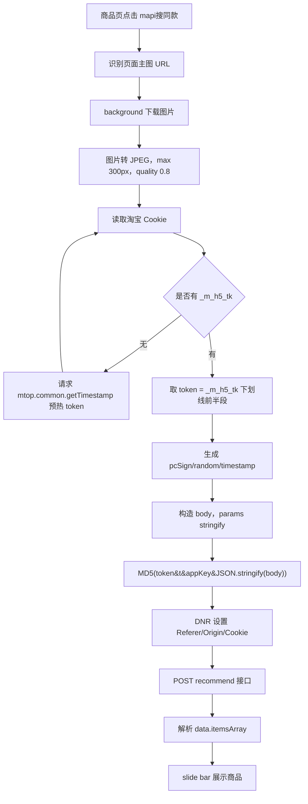

# 淘宝 mapi 以图搜同款 API 复用文档

> 当前实现位置：`C:\Users\YJ\Desktop\가격비교\imagesearch\extension`
> 当前插件版本：`0.5.12`
> 核心代码：`background.js` 的 `startMapiImageSearch()` / `searchTaobaoMapi()`

---

## 1. 功能目标

通过商品图片调用淘宝 MTOP 接口，直接拿到“以图搜同款”的商品列表，不依赖淘宝结果页 DOM 解析。

当前 mapi 链路支持：

- 从商品页识别主图
- 下载图片并转成 base64
- 按淘宝链路压缩成 JPEG，最大边 300px，质量 0.8
- 生成 `pcSign / random / timestamp`
- 读取 `_m_h5_tk` 并计算 MTOP `sign`
- 用 DNR 设置 `Referer / Origin`，必要时注入 Cookie
- POST 请求淘宝接口
- 解析 `itemsArray`
- 在当前页面右侧 slide bar 展示结果

---

## 2. 主接口

```text
POST https://h5api.m.taobao.com/h5/mtop.relationrecommend.wirelessrecommend.recommend/2.0/
```

Query 参数：

```text
jsv=2.7.4
appKey=12574478
t=<Date.now()>
sign=<MTOP_MD5_SIGN>
api=mtop.relationrecommend.wirelessrecommend.recommend
v=2.0
timeout=10000
type=originaljson
dataType=jsonp
```

请求头：

```http
Content-Type: application/x-www-form-urlencoded
Accept: application/json
Referer: https://s.taobao.com/search/
Origin: https://s.taobao.com
```

请求体：

```text
data=<URLSearchParams 编码后的 JSON 字符串>
```

注意：`params` 必须先 `JSON.stringify()`，也就是 body 形态是：

```json
{
  "appId": "46006",
  "params": "{\"m\":\"pc_picture_search\", ... }"
}
```

---

## 3. 完整调用流程



---

## 4. 图片处理

淘宝成功链路对图片有明显要求。不要直接把原图 base64 塞进 `strimg`。

当前实现：

```js
async function resizeImageForTaobaoMapi(dataUrl) {
  const blob = await (await fetch(dataUrl)).blob();
  const bitmap = await createImageBitmap(blob);
  const maxSize = 300;
  const ratio = Math.min(1, maxSize / Math.max(bitmap.width, bitmap.height));
  const width = Math.max(1, Math.round(bitmap.width * ratio));
  const height = Math.max(1, Math.round(bitmap.height * ratio));
  const canvas = new OffscreenCanvas(width, height);
  const ctx = canvas.getContext("2d");
  ctx.drawImage(bitmap, 0, 0, width, height);
  const resized = await canvas.convertToBlob({
    type: "image/jpeg",
    quality: 0.8
  });
  return blobToDataUrl(resized);
}
```

传给接口时需要去掉 data URL 前缀：

```js
function stripDataUrlPrefix(dataUrl) {
  return String(dataUrl || "").replace(/^data:[^,]+,/, "");
}
```

最终：

```js
strimg: stripDataUrlPrefix(dataUrl)
```

---

## 5. Cookie 与 token

MTOP 签名依赖 `_m_h5_tk`。

Cookie 格式通常是：

```text
_m_h5_tk=<token>_<expireTimestamp>
```

取 token：

```js
const token = decodeURIComponent(tokenCookie.value).split("_")[0];
```

当前查询范围：

```js
[
  { domain: "taobao.com" },
  { domain: ".taobao.com" },
  { domain: "h5api.m.taobao.com" },
  { domain: "taobao.com", partitionKey: {} },
  { domain: ".taobao.com", partitionKey: {} },
  { domain: "taobao.com", partitionKey: { topLevelSite: "https://taobao.com" } },
  { domain: ".taobao.com", partitionKey: { topLevelSite: "https://taobao.com" } },
  { url: "https://taobao.com" },
  { url: "https://www.taobao.com" },
  { url: "https://s.taobao.com" },
  { url: "https://h5api.m.taobao.com" }
]
```

去重策略：

- 按 cookie name 去重
- 如果存在 partition cookie，优先保留 partition cookie

如果读不到 `_m_h5_tk`，先预热：

```text
POST https://h5api.m.taobao.com/h5/mtop.common.getTimestamp/1.0/
```

预热后等待约 `500ms` 再重新读取 cookie。

---

## 6. pcSign / random / timestamp

淘宝图片搜索额外需要 PC 安全签名。

生成规则：

```js
const random = getRandomBase64(32);
const timestamp = `${Date.now()}`;
const payload = {
  pageFrom: "a21n57.imgsearch",
  imgFrom: "upload",
  random,
  timestamp
};
const salt = "6dbd0668a0634ae9badd25d3da236f47";
const pcSign = await sha256Base64(`${JSON.stringify(payload)}${salt}`);
```

字段写入 `params`：

```js
pcSign: pcSecurity.pcSign,
random: pcSecurity.random,
timestamp: pcSecurity.timestamp
```

典型形态：

```json
{
  "pcSign": "yxdVXXrHZPdgRBnVUG4xljS1papZN0RmOI1C5t5Vh/g=",
  "random": "TMzhG03oJ7n7dmtuUqw+Oa0fxuyoG3XVbm05yfCyYeA=",
  "timestamp": "1783397083012"
}
```

---

## 7. MTOP sign

`params` 必须先 stringify：

```js
body.params = JSON.stringify(body.params);
const bodyText = JSON.stringify(body);
```

签名公式：

```js
const sign = md5(`${token}&${timestamp}&${appKey}&${bodyText}`);
```

当前 appKey：

```js
const appKey = "12574478";
```

---

## 8. 请求 body 模板

核心字段：

```js
{
  appId: "46006",
  params: {
    m: "pc_picture_search",
    device: "HMA-AL00",
    isBeta: "false",
    grayHair: "false",
    from: "nt_history",
    brand: "HUAWEI",
    info: "wifi",
    index: "4",
    rainbow: "",
    schemaType: "auction",
    elderHome: "false",
    isEnterSrpSearch: "true",
    newSearch: "false",
    network: "wifi",
    subtype: "",
    hasPreposeFilter: "false",
    prepositionVersion: "v2",
    client_os: "Android",
    gpsEnabled: "false",
    searchDoorFrom: "srp",
    debug_rerankNewOpenCard: "false",
    homePageVersion: "v7",
    searchElderHomeOpen: "false",
    search_action: "initiative",
    sugg: "_4_1",
    sversion: "13.6",
    style: "list",
    ttid: "1@tbwang_mac_1.0.0#pc",
    needTabs: "true",
    areaCode: "CN",
    vm: "nw",
    countryNum: "156",
    page: 1,
    n: 48,
    q: "",
    qSource: "manual",
    pageSource: "a21bo.jianhua/a.201856.dimagesearch",
    myCNA: "",
    tab: "all",
    sort: "_coefp",
    filterTag: "",
    service: "",
    prop: "",
    loc: "",
    start_price: null,
    end_price: null,
    startPrice: null,
    endPrice: null,
    categoryp: "",
    pageSize: 60,
    strimg: "<base64 without data:image prefix>",
    imgFrom: "upload",
    pageFrom: "a21n57.imgsearch",
    pcSign: "<pcSign>",
    random: "<random>",
    timestamp: "<timestamp>"
  }
}
```

---

## 9. DNR 请求头改写

Manifest 需要权限：

```json
{
  "permissions": [
    "cookies",
    "declarativeNetRequest"
  ],
  "host_permissions": [
    "<all_urls>"
  ]
}
```

DNR 规则：

```js
{
  id: 6401,
  priority: 1,
  action: {
    type: "modifyHeaders",
    requestHeaders: [
      { header: "Referer", operation: "set", value: "https://s.taobao.com/search/" },
      { header: "Origin", operation: "set", value: "https://s.taobao.com" }
    ]
  },
  condition: {
    regexFilter: "h5api\\.m\\.taobao\\.com/h5/mtop\\.relationrecommend\\.wirelessrecommend\\.recommend/.*",
    resourceTypes: ["xmlhttprequest"],
    initiatorDomains: [chrome.runtime.id]
  }
}
```

Cookie 注入策略：

- 普通 cookie：不强行设置 Cookie 头，依赖 `credentials: "include"`
- partition cookie：把完整 cookie 串通过 DNR 设置到 `Cookie` 头

```js
if (tokenCookie.partitionKey) {
  requestHeaders.push({
    header: "Cookie",
    operation: "set",
    value: cookieHeader
  });
}
```

请求结束后清理 DNR 规则：

```js
await chrome.declarativeNetRequest.updateDynamicRules({
  removeRuleIds: [6401]
});
```

---

## 10. 成功响应结构

实测成功响应里商品列表在：

```js
json.data.itemsArray
```

部分资料或旧结构可能是：

```js
json.data.data.itemsArray
```

所以解析时要兼容两种：

```js
function getMapiItems(json) {
  if (json && json.data && Array.isArray(json.data.itemsArray)) {
    return json.data.itemsArray;
  }
  if (json && json.data && json.data.data && Array.isArray(json.data.data.itemsArray)) {
    return json.data.data.itemsArray;
  }
  return null;
}
```

成功 ret：

```json
{
  "ret": ["SUCCESS::调用成功"]
}
```

---

## 11. 商品字段映射

当前标准化字段：

```js
{
  id,
  title,
  detailUrl,
  imageUrl,
  price,
  sales,
  shopName,
  shopUrl,
  location
}
```

映射关系：

| 标准字段 | 淘宝字段 |
| --- | --- |
| `id` | `item.item_id` / `item.itemId` / `item.nid` |
| `title` | `item.title` |
| `detailUrl` | `item.auctionUrl` / `item.auctionURL` / `https://item.taobao.com/item.htm?id=<id>` |
| `imageUrl` | `item.pic_path` / `item.picUrl` |
| `price` | `item.umpPriceLog.item_price` / `item.priceShow.price` / `item.priceWap` |
| `sales` | `item.realSales` |
| `shopName` | `item.shopInfo.title` |
| `shopUrl` | `item.shopInfo.url` |
| `location` | `item.procity` |

注意：实测响应里有 `auctionURL` 大写 `URL`，解析时建议兼容：

```js
item.auctionUrl || item.auctionURL
```

---

## 12. 风控与错误判断

常见风控返回：

```json
{
  "ret": ["RGV587_ERROR::SM::哎哟喂,被挤爆啦,请稍后重试!"],
  "data": {
    "url": "https://bixi.alicdn.com/punish/..."
  }
}
```

判断逻辑：

```js
function assertMapiSuccess(json, text, items) {
  const ret = Array.isArray(json && json.ret) ? json.ret : [];
  const retText = ret.join("; ");
  const punishUrl = json && json.data && json.data.url;
  if (/RGV587|FAIL|ERROR|DENY|ILLEGAL|SESSION_EXPIRED/i.test(retText) || /punish|deny/i.test(punishUrl || "")) {
    throw new Error(`${retText || "mapi 被风控拦截"}${punishUrl ? `\n${punishUrl}` : ""}`);
  }
  if (!Array.isArray(items)) {
    throw new Error(retText || json && json.msg || text.slice(0, 500) || "mapi 未返回商品列表");
  }
}
```

降低风控概率的关键点：

- 图片必须压成 JPEG 300px / quality 0.8
- `pcSign / random / timestamp` 必须正确
- `Referer / Origin` 必须像来自 `s.taobao.com`
- `_m_h5_tk` token 要和请求 cookie 对得上
- `params` stringify 后再算 MTOP sign
- 不要重复塞一堆同名 Cookie

---

## 13. 当前插件中的调用模式

商品页 content script：

```js
chrome.runtime.sendMessage({
  type: "TBIS_MAPI_SEARCH_IMAGE",
  imageUrl,
  pageUrl: location.href,
  title: document.title,
  source: "productMapiButton",
  displayMode: "sidebar"
});
```

background 返回：

```js
{
  ok: true,
  result: {
    requestId,
    ok: true,
    record: {
      ok: true,
      products,
      rawCount,
      ret,
      searchUrl
    }
  }
}
```

如果 `displayMode === "sidebar"`：

- 不打开新 tab
- 直接把 record 返回给当前页面
- 当前页面 slide bar 渲染商品

如果不传 `displayMode`：

- 结果写入 `chrome.storage.local`
- 打开 `mapi_results.html?requestId=...`

---

## 14. 最小复刻清单

复用到新项目时，至少需要这些函数或等价实现：

- `prepareImagePayload(imageUrl)`
- `resizeImageForTaobaoMapi(dataUrl)`
- `getTaobaoCookies()`
- `warmupTaobaoMtopToken()`
- `createTaobaoPcSecuritySign({ pageFrom, imgFrom })`
- `md5(value)`
- `buildMapiBody(dataUrl, pcSecurity)`
- `setMapiRequestHeaders(cookieHeader)`
- `searchTaobaoMapi(dataUrl)`
- `getMapiItems(json)`
- `normalizeMapiProducts(items)`

Manifest 至少需要：

```json
{
  "permissions": [
    "cookies",
    "declarativeNetRequest",
    "storage",
    "tabs"
  ],
  "host_permissions": [
    "<all_urls>"
  ]
}
```

---

## 15. 调试建议

如果返回空结果：

1. 先看 `ret` 是否是 `SUCCESS::调用成功`
2. 看商品列表是在 `data.itemsArray` 还是 `data.data.itemsArray`
3. 看 `itemsArray.length`
4. 打印第一条商品的 `item_id / title / pic_path / priceShow`

如果缺 `_m_h5_tk`：

1. 确认当前浏览器已登录淘宝
2. 打开一次 `https://s.taobao.com/search`
3. 触发 `warmupTaobaoMtopToken()`
4. 重新读取 cookie

如果返回 `RGV587_ERROR`：

1. 对比真实成功请求和当前请求的 query/body/header
2. 优先检查图片尺寸、`pcSign`、`sign`、Cookie
3. 确认 `params` 是字符串
4. 确认 DNR 规则生效

---

## 16. 已验证样例

成功响应：

```json
{
  "api": "mtop.relationrecommend.wirelessrecommend.recommend",
  "ret": ["SUCCESS::调用成功"],
  "data": {
    "itemsArray": [
      {
        "item_id": "1054463807693",
        "title": "韩国直邮Nucare控糖低卡羊羹加餐软糯糕点无负担零食代餐糕点880g",
        "pic_path": "https://g-search2.alicdn.com/img/bao/uploaded/i4/O1CN01IkgAma1nctR7fLiGE_!!2194075111.jpg",
        "priceShow": {
          "unit": "¥",
          "price": "93"
        },
        "realSales": "0人付款",
        "procity": "韩国"
      }
    ]
  }
}
```

本地解析自测结果：

```text
60 60 韩国直邮Nucare控糖低卡羊羹加餐软糯糕点无负担零食代餐糕点880g 93
```

